# Node-Express

## Installation de EXPRESS et de AXIOS
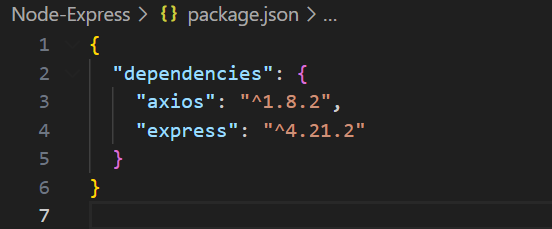

## Définir le tableaux d'utilisateurs et les routes CRUD
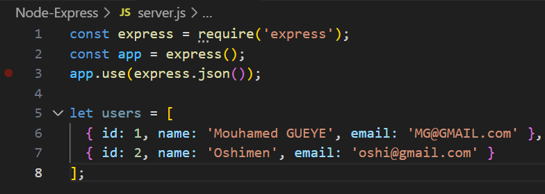

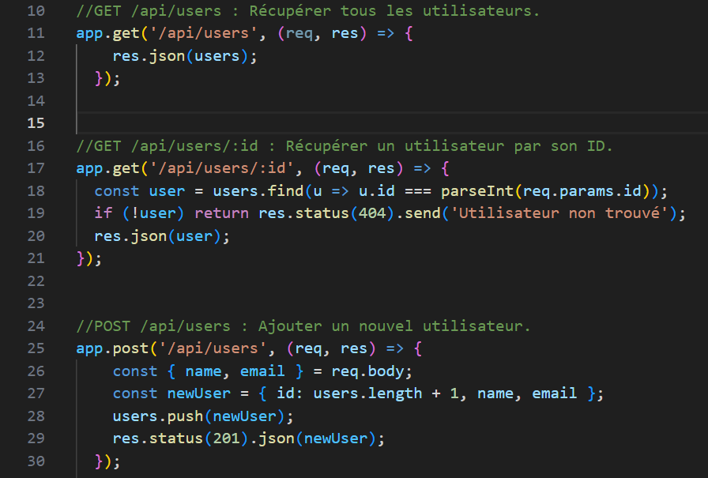

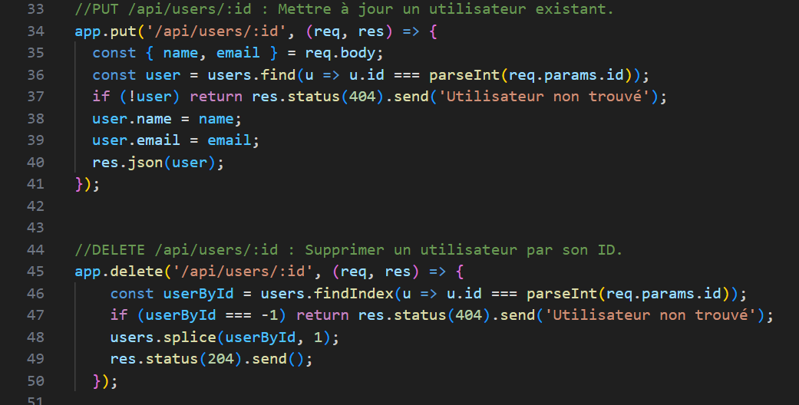

Pour tester le tout avec POSTMAN, il faut ajouter cette ligne pour pouvoir démarrer notre serveur
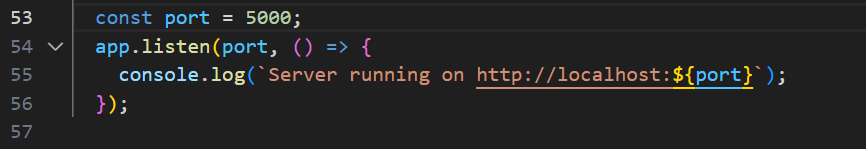

### Test avec Postman des différentes routes

Récupération de la liste des users
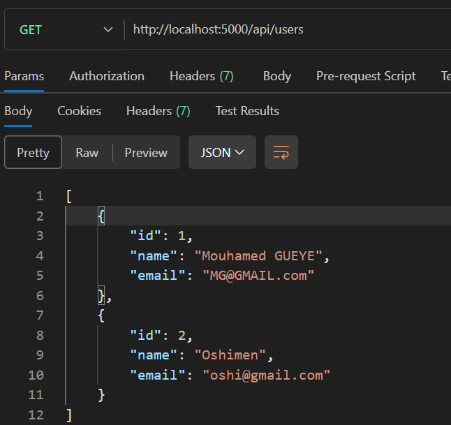

Récupération d'un user avec son id 
    -> S'il existe 
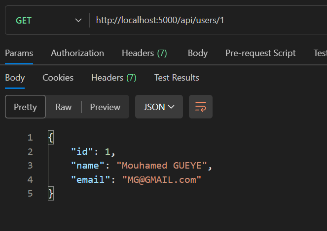

    -> S'il n'existe pas 
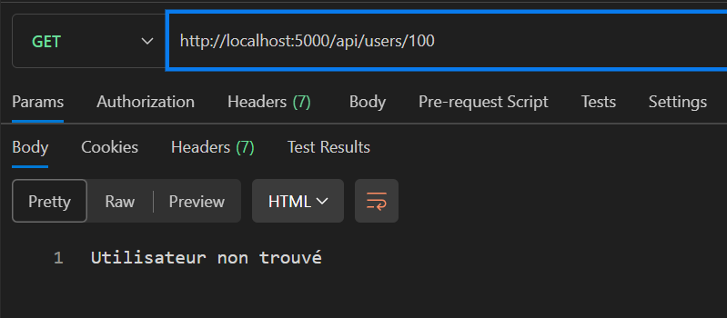

Ajout d'un nouveau user 
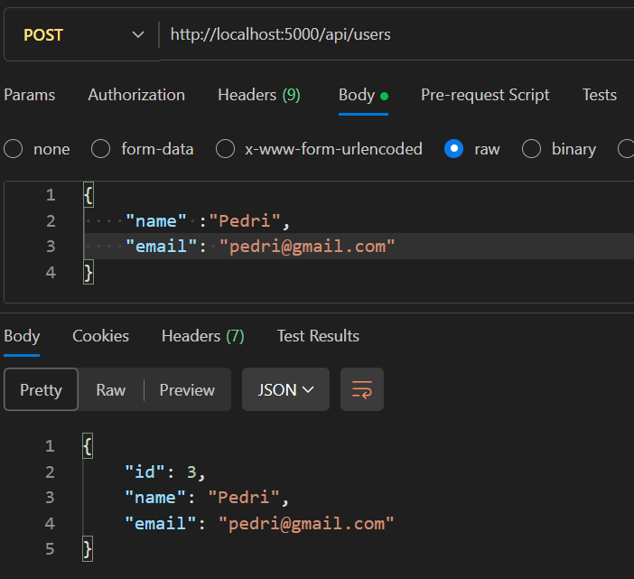

    -> Visualiser dans la nouvelle liste
    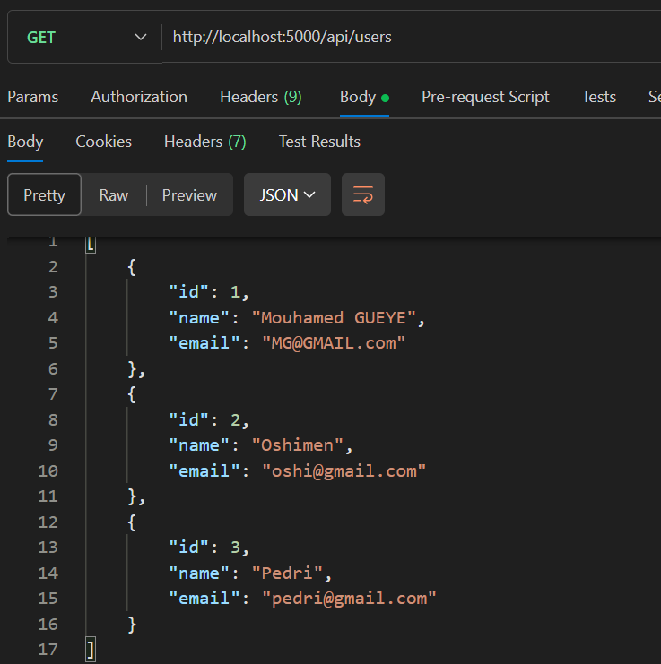

Mis à jour du user ajouté 
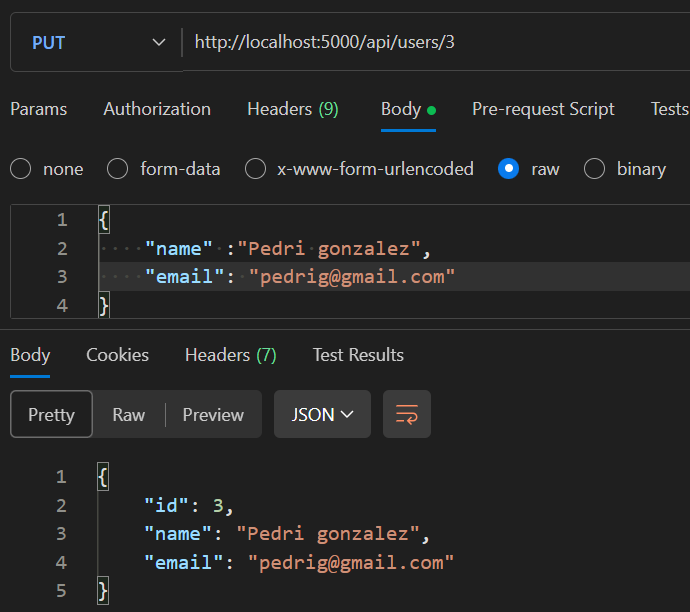

    -> Visualiser dans la nouvelle liste
    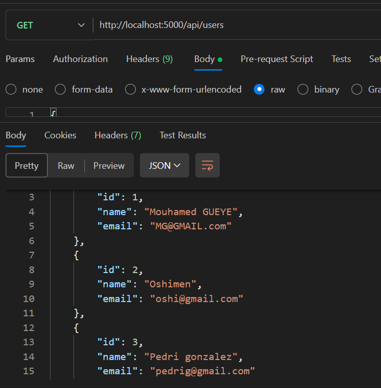

Supppression d'un user 
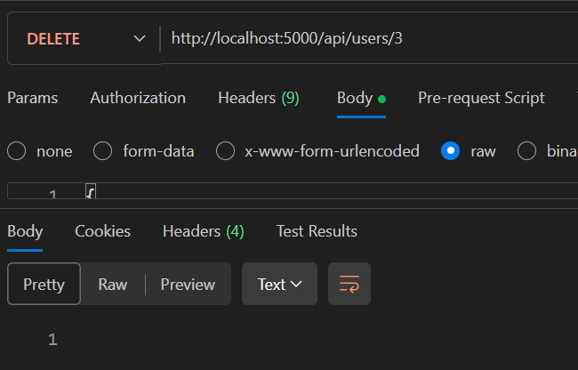

    ->Visualiser dans la nouvelle liste
    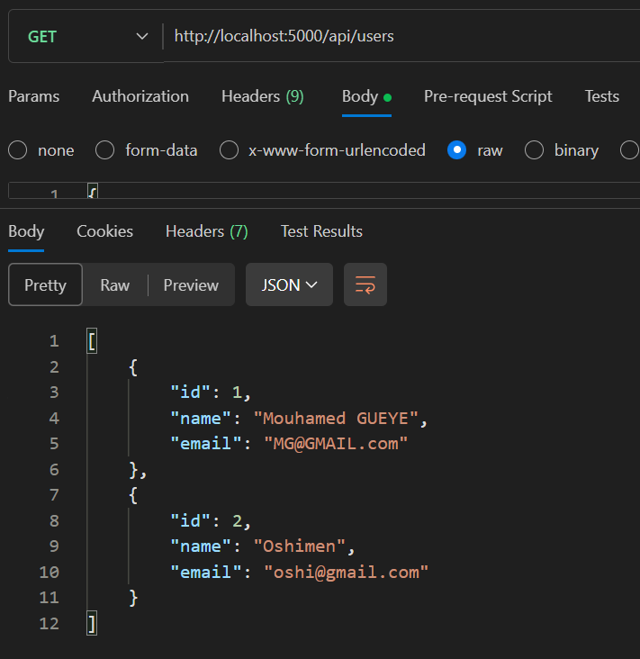