# Node-Express

## Installation de EXPRESS et de AXIOS
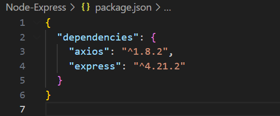

## Définir le tableau d'utilisateurs et les routes CRUD
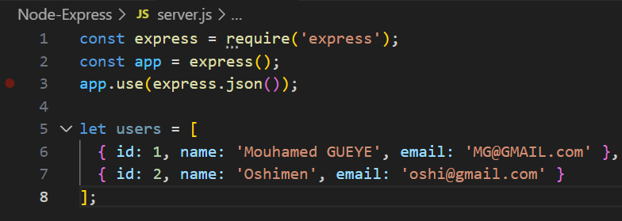

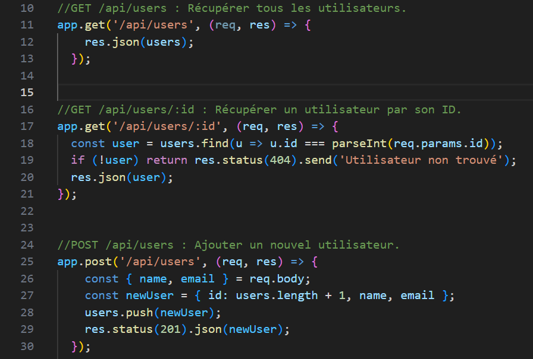

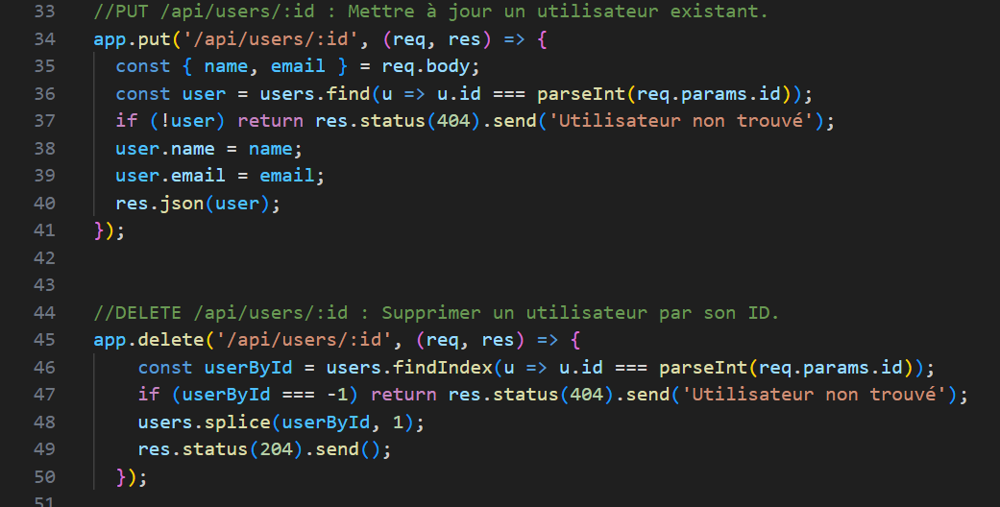

Pour tester le tout avec POSTMAN, il faut ajouter cette ligne pour pouvoir démarrer notre serveur :
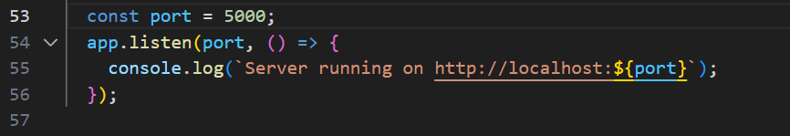

### Test avec Postman des différentes routes

1. **Récupération de la liste des utilisateurs**  
   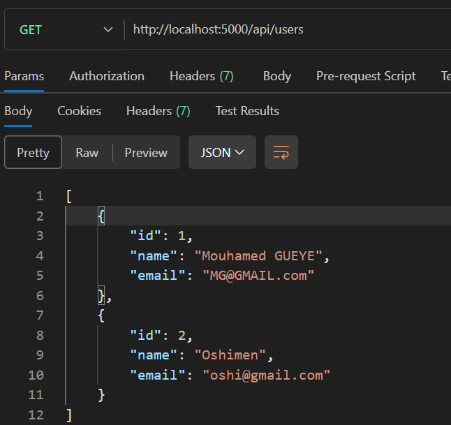

2. **Récupération d'un utilisateur avec son id :**  
   -> **S'il existe**  
   

   -> **S'il n'existe pas**  
   

3. **Ajout d'un nouveau utilisateur**  
   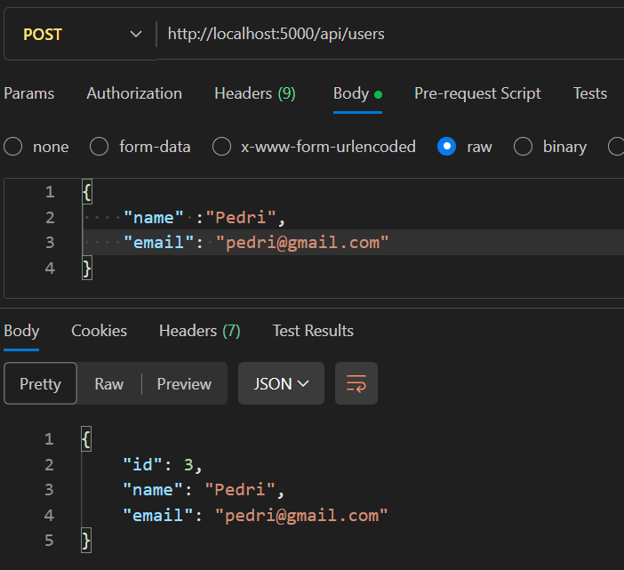

   -> **Visualiser dans la nouvelle liste**  
   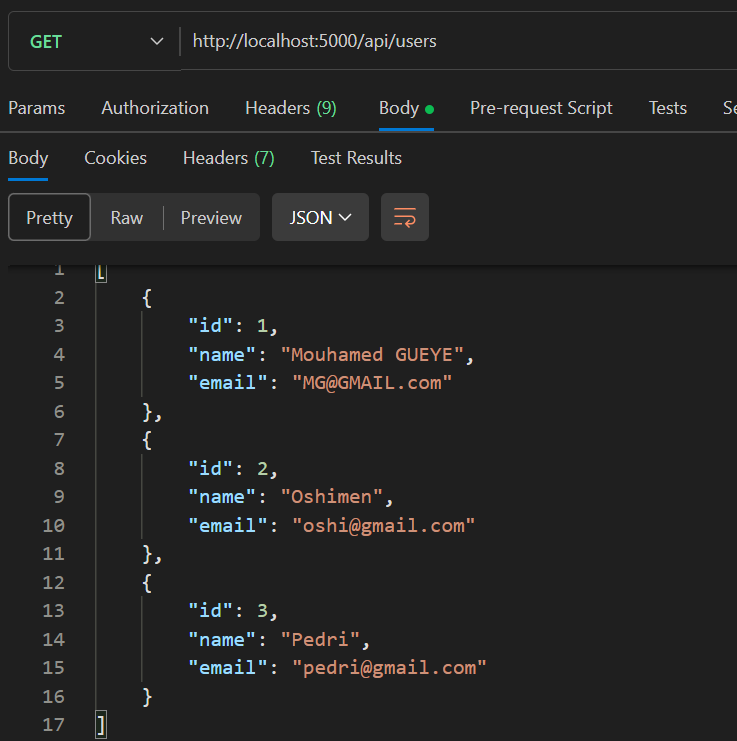

4. **Mise à jour de l'utilisateur ajouté**  
   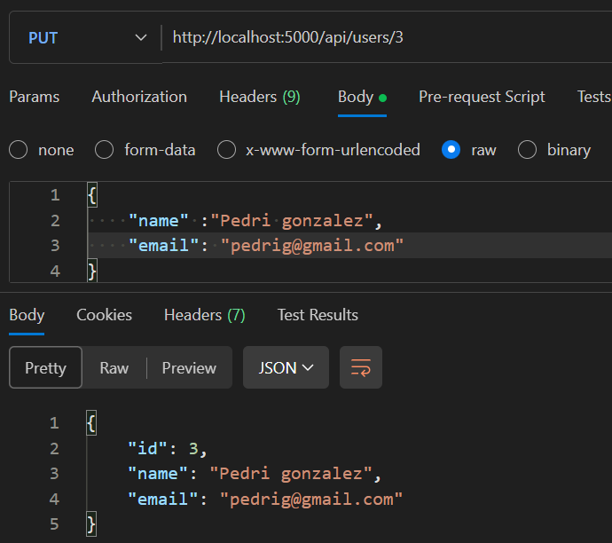

   -> **Visualiser dans la nouvelle liste**  
   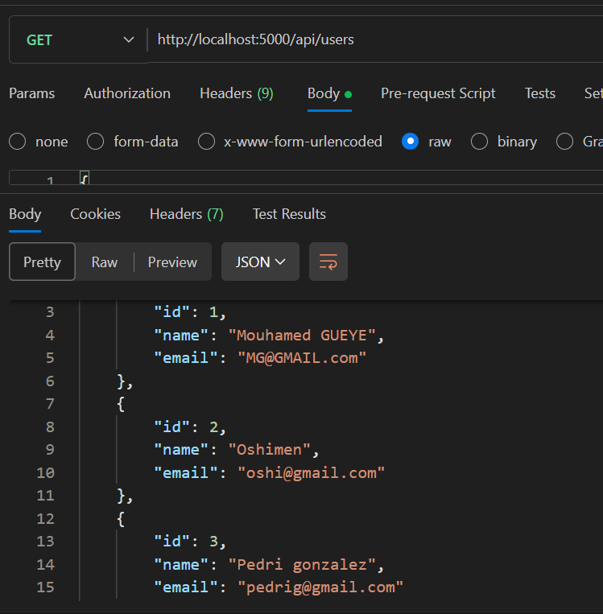

5. **Suppression d'un utilisateur**  
   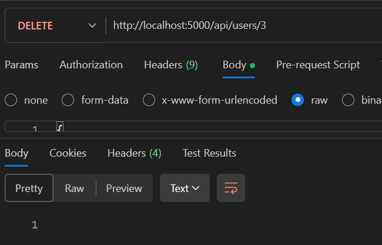

   -> **Visualiser dans la nouvelle liste**  
   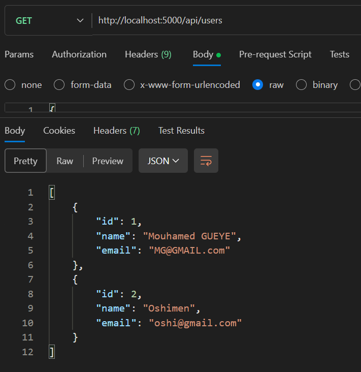

6. **Récupération user api externe avec axios**
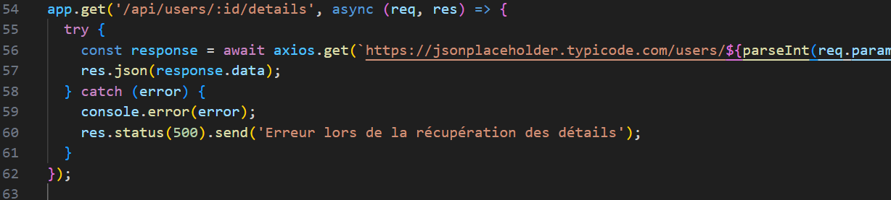

   -> **Visualiser résultat avec Postman**
   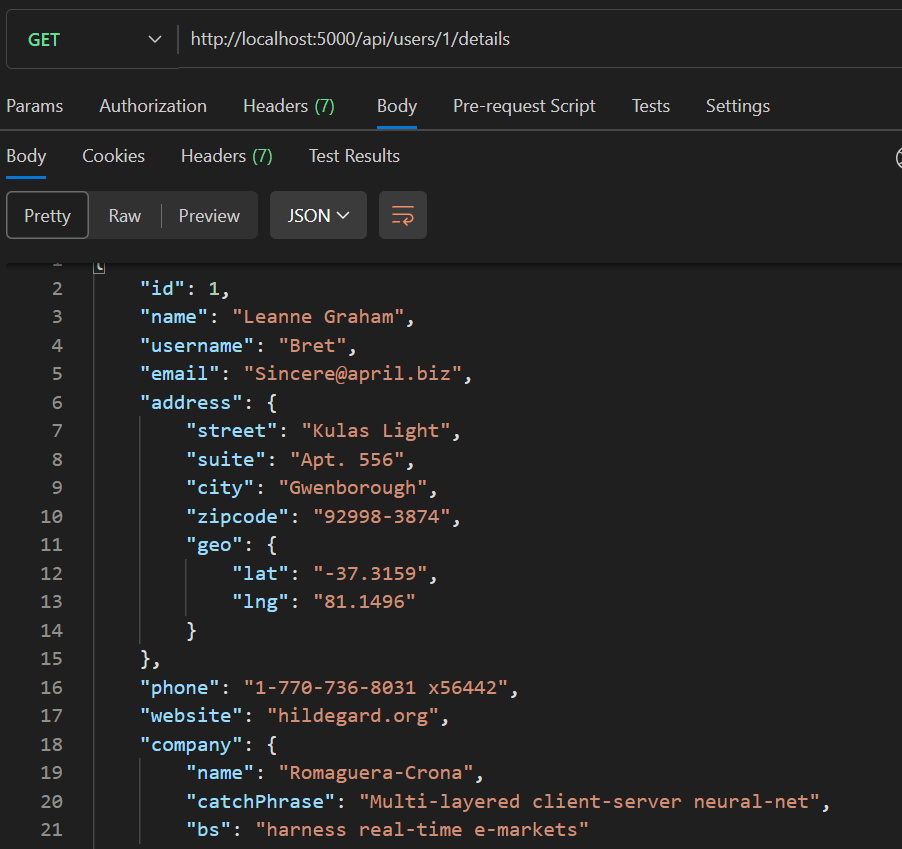
